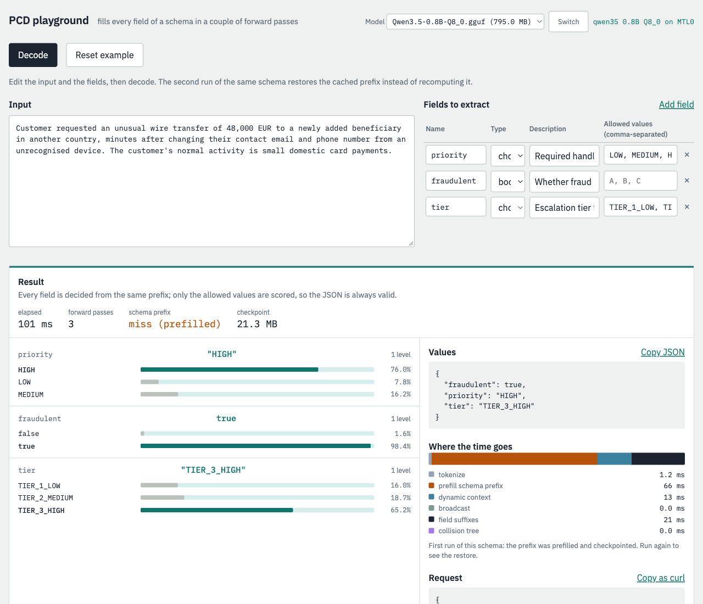
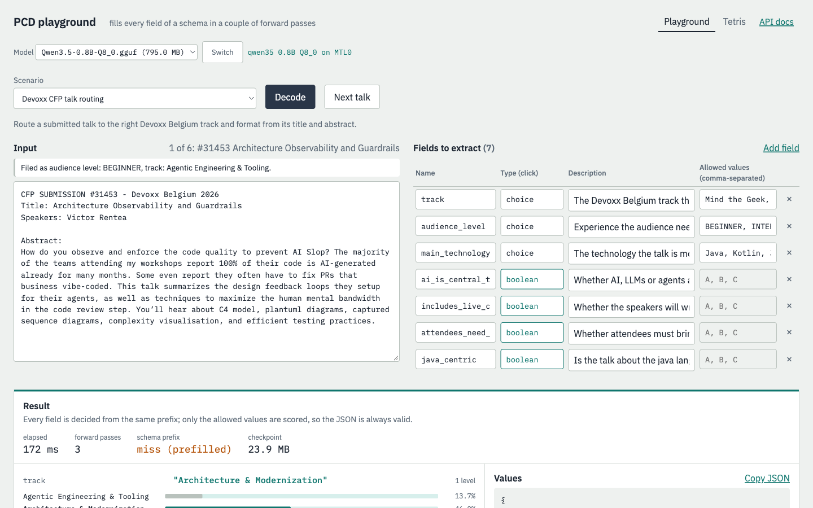
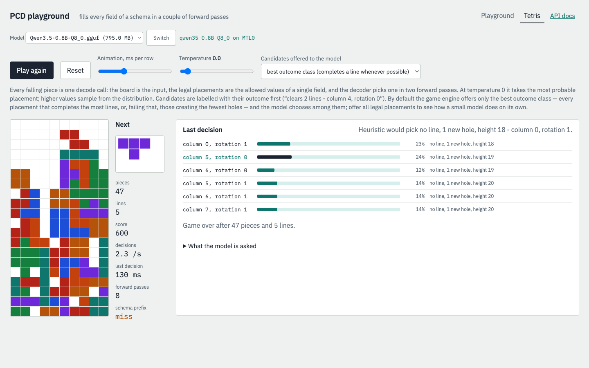
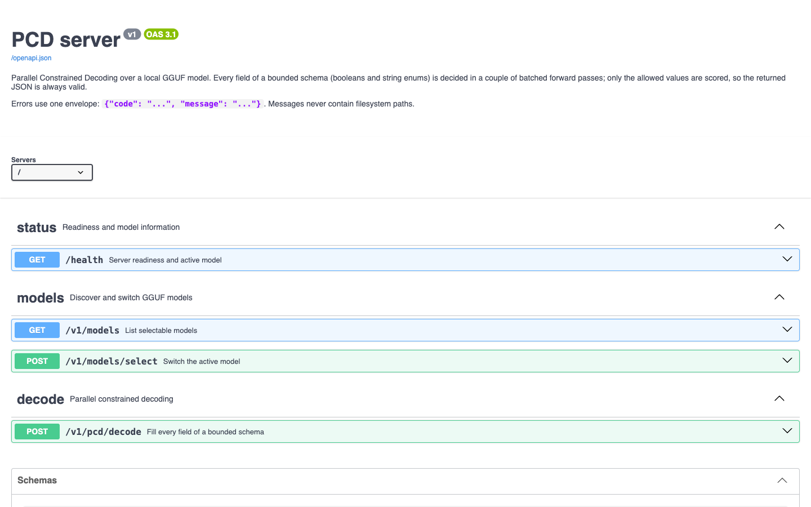

# Parallel Constrained Decoding (PCD) Server

**Turn text into guaranteed bounded JSON with a local GGUF model.**

[](CMakeLists.txt)
[](ui/openapi.json)
[](https://github.com/ggml-org/llama.cpp)
[](LICENSE)

[Quick start](#quick-start) · [Try the API](#make-your-first-decode) · [Web UI](#explore-the-web-ui) · [REST reference](#rest-api) · [How it works](#how-a-decode-works)

PCD Server is a native C++ REST service for **Parallel Constrained Decoding**. Give it text and a list of bounded fields; it selects exactly one allowed value for every field and returns both the assembled JSON and the probability distribution behind each decision.

The model never writes JSON syntax. It only scores values your application allows, so there is nothing to parse, repair, or retry.



## Why PCD Server?

| | |
|---|---|
| **Always-valid output** | Results are assembled by the server from allowed booleans and string enums—not generated token by token. |
| **Parallel decisions** | Every field shares one prompt prefix and is evaluated in batched forward passes. |
| **Local by default** | Run a GGUF model through the embedded, pinned llama.cpp runtime. Your input stays on your machine. |
| **Probabilities included** | Get a normalized probability for every allowed value, not just the winner. |
| **Fast repeated schemas** | Immutable, bounded LRU checkpoints reuse the expensive schema prefix across requests. |
| **Batteries included** | The binary embeds a Playground, scenario library, Tetris visualization, and OpenAPI specification. |

PCD Server is a good fit for routing, triage, moderation, tagging, policy decisions, feature extraction, and any workflow where every output must come from a known finite set.

> [!NOTE]
> This release supports **booleans and bounded string enums**. See [current scope](#current-scope) before integrating.

## Quick start

### 1. Install prerequisites

#### macOS — Apple Silicon

- Xcode Command Line Tools with an accepted license (`sudo xcodebuild -license accept`)
- [CMake](https://cmake.org/) 3.25 or newer (`brew install cmake`)
- `curl` and `shasum` (included with macOS)
- `jq` for the end-to-end script (`brew install jq`)

llama.cpp offloads all model layers to Metal on an Apple Silicon Mac.

#### Linux

- GCC 12+ or Clang 15+
- CMake 3.25+, Git, curl, and jq

Linux uses the backend selected by llama.cpp and runs on CPU by default. To use a supported GPU backend, pass the corresponding llama.cpp CMake option—for example, `-DGGML_CUDA=ON` for CUDA.

### 2. Download, build, and run

```bash
git clone https://github.com/stephanj/pcdServer.git
cd pcdServer

./scripts/download-default-model.sh
cmake -S . -B build -DCMAKE_BUILD_TYPE=Release
cmake --build build -j
ctest --test-dir build --output-on-failure

./build/pcd_server
```

The first configure/build fetches pinned dependencies and compiles llama.cpp, so it can take a few minutes. The download script installs `Qwen3.5-0.8B-Q8_0.gguf` under `models/` and verifies its SHA-256 checksum.

When the server is ready:

```text
loaded Qwen3.5-0.8B-Q8_0.gguf (qwen35 0.8B Q8_0) on MTL0
pcd_server v1 listening on http://127.0.0.1:8090
```

### 3. Check readiness

```bash
curl -s http://127.0.0.1:8090/health
```

```json
{
  "apiVersion": "v1",
  "backend": "MTL0",
  "description": "qwen35 0.8B Q8_0",
  "model": "Qwen3.5-0.8B-Q8_0.gguf",
  "ready": true,
  "status": "ok"
}
```

Then open:

- **Playground:** <http://127.0.0.1:8090/>
- **Interactive API docs:** <http://127.0.0.1:8090/docs>
- **Raw OpenAPI 3.1:** <http://127.0.0.1:8090/openapi.json>

## Make your first decode

This request classifies a suspicious transfer into two independently bounded fields:

```bash
curl -s http://127.0.0.1:8090/v1/pcd/decode \
  -H 'Content-Type: application/json' \
  -d '{
    "context": "Customer requested an unusual wire transfer of 48,000 EUR to a newly added beneficiary in another country.",
    "fields": [
      {
        "name": "priority",
        "description": "Required handling priority",
        "choices": ["LOW", "MEDIUM", "HIGH"]
      },
      {
        "name": "fraudulent",
        "description": "Whether fraud is suspected",
        "choices": [false, true]
      }
    ]
  }'
```

Representative response:

```json
{
  "model": "Qwen3.5-0.8B-Q8_0.gguf",
  "values": {
    "priority": "HIGH",
    "fraudulent": true
  },
  "fields": [
    {
      "name": "priority",
      "value": "HIGH",
      "probability": 0.76,
      "probabilities": {
        "LOW": 0.08,
        "MEDIUM": 0.16,
        "HIGH": 0.76
      },
      "levels": 1
    },
    {
      "name": "fraudulent",
      "value": true,
      "probability": 0.98,
      "probabilities": {
        "false": 0.02,
        "true": 0.98
      },
      "levels": 1
    }
  ],
  "metrics": {
    "elapsedMs": 39.8,
    "forwardPasses": 2,
    "schemaCacheStatus": "hit",
    "checkpointBytes": 22332068,
    "phasesMs": {
      "tokenize": 0.2,
      "restoreOrPrefill": 5.8,
      "dynamicContext": 13.5,
      "broadcast": 0.04,
      "suffix": 20.8,
      "tree": 0.0
    }
  }
}
```

- `values` is the ready-to-use result object.
- `fields[].probabilities` is a softmax over the allowed values only and sums to 1.
- `fields[].probability` is the winning value's probability.
- `fields[].levels` reports collision-tree depth; `1` means every choice began with a distinct token.
- `metrics` exposes end-to-end latency, native forward passes, cache behavior, and phase timings.

## Explore the web UI

The browser UI is compiled into `pcd_server`; there is no separate frontend process to install or deploy.

### Playground and real-world scenarios

Edit the input, fields, descriptions, and allowed values, then inspect every probability, the assembled result, phase timings, and the equivalent `curl` command. The scenario picker includes spam and phishing triage, Devoxx CFP routing, large enterprise schemas, and a 255-choice customs router.



### Tetris, powered by decode calls

The Tetris view makes constrained decoding visible: every piece is one `POST /v1/pcd/decode` request. The board is the context, legal placements are the allowed values, and the selected move comes with its probability distribution.



### OpenAPI documentation

`/docs` renders all four endpoints as interactive Swagger UI documentation. The OpenAPI document itself is embedded and always available at `/openapi.json`; the `/docs` renderer loads Swagger UI assets from jsDelivr and therefore needs internet access.



## REST API

All API responses are `application/json`. The versioned endpoints live under `/v1`; readiness remains at `/health`.

| Method | Path | Purpose |
|---|---|---|
| `GET` | `/health` | Report API version, readiness, active model, model description, and backend. |
| `GET` | `/v1/models` | Rescan the model directory and list selectable GGUF files. |
| `POST` | `/v1/models/select` | Load, validate, and transactionally activate a model by identifier. |
| `POST` | `/v1/pcd/decode` | Fill every field of a bounded schema and return values, probabilities, and metrics. |

The canonical machine-readable contract is [`ui/openapi.json`](ui/openapi.json).

### Decode request

```json
{
  "context": "Text the model should classify or extract from.",
  "fields": [
    {
      "name": "sentiment",
      "description": "Overall sentiment of the text",
      "choices": ["NEGATIVE", "NEUTRAL", "POSITIVE"]
    },
    {
      "name": "needs_review",
      "description": "Whether a human should review this item",
      "choices": [false, true]
    }
  ]
}
```

Fields are ordered and names must be unique. A field's choices must be either:

- 2–256 distinct, non-empty strings; or
- exactly `[false, true]`.

Descriptions are shown to the model and may be empty. Field names become keys in the returned `values` object.

### Model discovery and switching

`GET /v1/models` rescans `--models-dir` on every request, so a newly copied `.gguf` appears without a restart:

```bash
curl -s http://127.0.0.1:8090/v1/models
```

```json
{
  "active": "Qwen3.5-0.8B-Q8_0.gguf",
  "activeModel": {
    "id": "Qwen3.5-0.8B-Q8_0.gguf",
    "description": "qwen35 0.8B Q8_0",
    "architecture": "qwen35",
    "backend": "MTL0",
    "contextSize": 8192,
    "cacheEntries": 1,
    "cacheBytes": 22332068
  },
  "models": [
    {
      "id": "Qwen3.5-0.8B-Q8_0.gguf",
      "bytes": 833592096,
      "active": true
    }
  ]
}
```

Select an identifier returned by that endpoint:

```bash
curl -s http://127.0.0.1:8090/v1/models/select \
  -H 'Content-Type: application/json' \
  -d '{"id":"Qwen3.5-0.8B-Q8_0.gguf"}'
```

The replacement is fully loaded and validated before it becomes active. If loading fails, the current model stays active. Client input is matched against discovered identifiers and is never treated as an arbitrary filesystem path. A successful switch clears the old model's schema checkpoints.

### Errors

Errors use one stable envelope:

```json
{
  "code": "invalid_request",
  "message": "duplicate field name: priority"
}
```

Messages never expose filesystem paths.

| Status | When |
|---|---|
| `400` | Malformed JSON, invalid request shape, duplicate names, mixed choice types, exceeded limits, or a request that does not fit the model context. |
| `404` | Unknown model identifier or route. |
| `413` | Request body exceeds 1 MiB. |
| `422` | The chat template or candidate tokenization cannot be compiled safely. |
| `500` | llama.cpp or an unexpected internal operation failed. |
| `503` | No model is loaded. |

### Request limits

| Resource | Limit |
|---|---:|
| Fields | 1–63 |
| Choices per field | 2–256 |
| Context text | 64 KiB |
| Total candidate tokens | 4096 |
| Request body | 1 MiB |
| Collision-tree depth | 24 levels |

The complete rendered request—schema prefix, context, field suffixes, and candidate paths—must also fit the active model's context window. The default model is configured for 8192 tokens.

## Configure the server

```bash
./build/pcd_server --help
```

```text
usage: ./build/pcd_server [options]
  --bind ADDRESS        default 127.0.0.1
  --port PORT           default 8090
  --models-dir PATH     default models
  --model PATH          overrides PCD_GGUF and the default model
  --cache-entries N     default 32
  --cache-bytes BYTES   default 536870912
  --help
```

| Flag | Default | Meaning |
|---|---|---|
| `--bind ADDRESS` | `127.0.0.1` | Listener address. Use `0.0.0.0` only when you intend to expose the unauthenticated service. |
| `--port PORT` | `8090` | Listener port. |
| `--models-dir PATH` | `models` | Directory scanned for selectable `.gguf` files. |
| `--model PATH` | default model | GGUF loaded during startup. |
| `--cache-entries N` | `32` | Maximum number of cached schema checkpoints. |
| `--cache-bytes BYTES` | `536870912` | Maximum total checkpoint memory (512 MiB). |

Startup model precedence is:

1. `--model PATH`
2. `PCD_GGUF`
3. `models/Qwen3.5-0.8B-Q8_0.gguf`

If that file does not exist, the server still starts. `/health` reports `ready: false`, and decode requests return `503` until a model is selected. `SIGINT` and `SIGTERM` stop the listener and release the active model cleanly.

## How a decode works

1. **Validate** — check the request and build a canonical cache key from the model fingerprint, chat template, prompt format version, and ordered schema.
2. **Prepare the schema prefix** — render a system prompt containing every field, description, and allowed value. On a cache miss, decode it into sequence 0 and save a full checkpoint; on a hit, restore that checkpoint.
3. **Append dynamic context** — decode the input text, close the user turn, add the assistant header (including Qwen3.5's empty `<think></think>` block), and open the result object.
4. **Broadcast** — copy sequence 0 to one sequence per field.
5. **Decode field suffixes** — batch every field's JSON member prefix and request logits only on each final token.
6. **Score allowed values** — compute softmax over candidate tokens only. Choices that share the winning token remain live and resolve level by level in batched collision-tree passes—for example, `BILLING` versus `BILLING_DISPUTE`.
7. **Assemble JSON** — write the winning scalar for every field into the response object.

### Why full checkpoints?

Qwen3.5 is a hybrid model with recurrent Gated DeltaNet layers alongside attention. Its recurrent state cannot be partially rewound safely: on Qwen3.5-0.8B, `llama_memory_seq_rm` on a position sub-range returns `false` and leaves the sequence unchanged. Continuing after that failed trim would decode against stale state.

PCD Server instead clears memory and restores a **complete host-side checkpoint** created with `llama_state_seq_*_ext` and `LLAMA_STATE_SEQ_FLAGS_NONE`. It verifies the exact save/restore byte count and restored position. A failed restore falls back to cold prefill and discards the checkpoint; two consecutive failures disable caching for that schema until the model is reloaded.

Published checkpoints are immutable and held in an entry- and byte-bounded LRU. On the project test machine, a three-field Qwen3.5-0.8B checkpoint is about 22 MiB and restores in about 6 ms, versus about 36 ms for cold prefill. These are example Apple Silicon measurements, not latency guarantees.

`metrics.schemaCacheStatus` tells you which path was used:

| Value | Meaning |
|---|---|
| `miss` | The schema prefix was computed and checkpointed. |
| `hit` | A previous checkpoint was restored. |
| `fallback` | Restore failed, so the prefix was recomputed and the bad checkpoint removed. |

## Concurrency and model lifecycle

HTTP handling and model discovery can run concurrently. Inference for a given model context is serialized behind one mutex because llama sequence memory is mutable.

A model replacement loads outside that inference mutex and takes a write lock only for the final swap. In-flight requests finish on the previous engine; the engine is released when its last request completes.

## Test and benchmark

Unit and HTTP tests run without a model:

```bash
ctest --test-dir build --output-on-failure
```

Tests tagged `[native]` run only when `PCD_TEST_GGUF` points to a GGUF file:

```bash
PCD_TEST_GGUF=models/Qwen3.5-0.8B-Q8_0.gguf \
  ./build/pcd_tests "[native]"

PCD_TEST_GGUF=models/Qwen3.5-0.8B-Q8_0.gguf \
  ./tests/e2e.sh
```

Native coverage includes checkpoint save/restore, cold-versus-cached equivalence, alternating contexts and schemas, forced restore failure, repeated cache hits, collision resolution, failed model switches, and an HTTP miss-then-hit round trip.

Run the benchmark with:

```bash
./build/pcd_bench \
  --model models/Qwen3.5-0.8B-Q8_0.gguf \
  --request tests/data/triage-request.json \
  --runs 5
```

It performs one warm-up, then measures a cold and cached decode for each run. Output includes median phase timings, checkpoint bytes, cache statuses, and selected values. CTest does not enforce timing thresholds.

## Current scope

### Supported

- Local GGUF models supported by the pinned llama.cpp runtime
- Bounded string enums with 2–256 distinct, non-empty choices
- Boolean fields expressed as `[false, true]`
- Up to 63 ordered fields per request
- Full per-choice probabilities and decode metrics
- Hot model discovery and transactional model switching
- Bounded in-memory schema checkpoint caching
- Embedded Playground, scenarios, Tetris visualization, and OpenAPI document

### Not currently supported

- Free-form strings, numbers, objects, or arrays
- Arbitrary JSON Schema
- Authentication, authorization, or TLS termination
- Multiple simultaneously resident models
- Parallel inference against one model context
- A stability guarantee for the `v1` API beyond this repository version

> [!IMPORTANT]
> The server has no authentication. Its default bind address is loopback-only; add an authenticated reverse proxy before exposing it to a network you do not trust.

## Pinned dependencies

CMake fetches exact upstream tags during configuration:

| Dependency | Version | Role |
|---|---:|---|
| [llama.cpp](https://github.com/ggml-org/llama.cpp) | `v0.4.1` | GGUF loading and inference |
| [cpp-httplib](https://github.com/yhirose/cpp-httplib) | `v0.56.0` | HTTP server |
| [nlohmann/json](https://github.com/nlohmann/json) | `v3.12.0` | JSON parsing and serialization |
| [Catch2](https://github.com/catchorg/Catch2) | `v3.15.2` | Test framework |

The UI assets under [`ui/`](ui/) are embedded into the executable at build time by [`cmake/embed_resource.cmake`](cmake/embed_resource.cmake).

## License

PCD Server is released under the [MIT License](LICENSE). It embeds llama.cpp, cpp-httplib, and nlohmann/json, all MIT-licensed; their notices are reproduced in [THIRD_PARTY_NOTICES.md](THIRD_PARTY_NOTICES.md).
